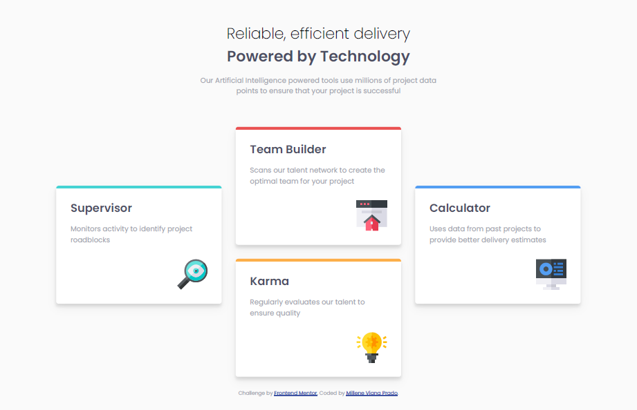

# Frontend Mentor - Four card feature section solution

This is a solution to the [Four card feature section challenge on Frontend Mentor](https://www.frontendmentor.io/challenges/four-card-feature-section-weK1eFYK). Frontend Mentor challenges help you improve your coding skills by building realistic projects. 

## Table of contents

- [Overview](#overview)
  - [The challenge](#the-challenge)
  - [Screenshot](#screenshot)
  - [Links](#links)
- [My process](#my-process)
  - [Built with(#built-with)
- [Acknowledgments](#acknowledgments)

## Overview

### The challenge

The challenge is to build out this feature section and get it looking as close to the design as possible.

The users should:

- View the optimal layout for the site depending on their device's screen size.

### Screenshot

This is my result of the challenge:

### Links

- Solution URL: [Add solution URL here](https://your-solution-url.com)

## My process

### Built with

- Semantic HTML5 markup
- CSS custom properties
- Flexbox

## Acknowledgments

I would like to thank Florin Pop [forin-pop.com](https://www.florin-pop.com/) for his video which was very useful during the development of this challenge and helped me to learn many things.

