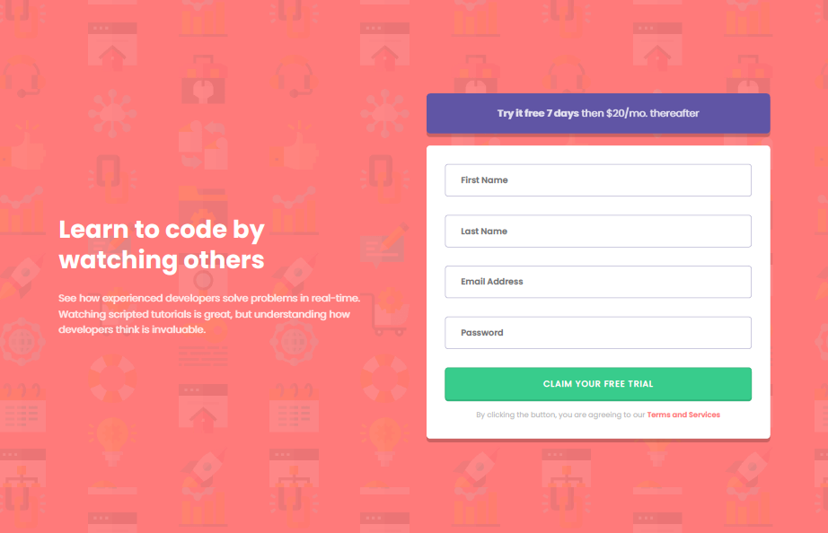

# Frontend Mentor - Intro component with sign up form solution

This is a solution to the [Intro component with sign up form challenge on Frontend Mentor](https://www.frontendmentor.io/challenges/intro-component-with-signup-form-5cf91bd49edda32581d28fd1). Frontend Mentor challenges help you improve your coding skills by building realistic projects. 

## Table of contents

- [Overview](#overview)
  - [The challenge](#the-challenge)
  - [Screenshot](#screenshot)
  - [Links](#links)
- [My process](#my-process)
  - [Built with](#built-with)
- [Acknowledgments](#acknowledgments)

## Overview

### The challenge

The challenge is to build out this feature section and get it looking as close to the design as possible.

The users should:

- View the optimal layout for the site depending on their device's screen size.

### Screenshot

This is my result of the challenge:

### Links

- Solution URL: [Solution URL here](https://github.com/millenevprado/frontend-mentor-challenges/blob/main/intro-component-with-signup-form-master/index.html)

## My process

### Built with

- Semantic HTML5 markup
- CSS custom properties
- Flexbox
- JavaScript

## Acknowledgments

I would like to thank Florin Pop [forin-pop.com](https://www.florin-pop.com/) for his video which was very useful during the development of this challenge and helped me to learn many things.

